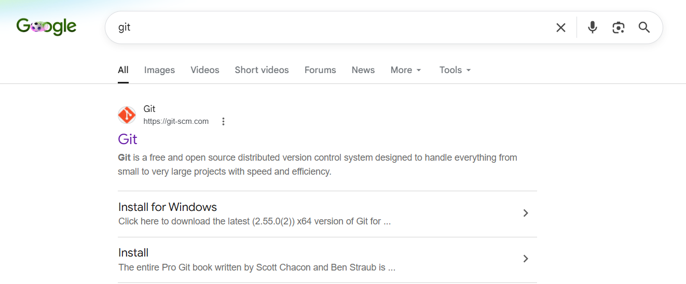

# 1 How to install git on Windows?

Search "git"

<figure><figcaption></figcaption></figure>

Open the website

[https://git-scm.com/](https://git-scm.com/)

Click on "Install for Windows"

<figure><figcaption></figcaption></figure>

Click on "Click here to download"

<figure><figcaption></figcaption></figure>

Install the **Git**

<figure><figcaption></figcaption></figure>

Done✅ 
