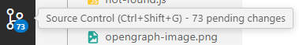

# Vs Code Source Control

VS Source Control

No symbol: Unchanged

<mark style="color:$success;">U</mark>: Untracked files (Meaning - The file is new or changed but has not been added to the repository)

<mark style="color:$success;">A</mark>: Added files (Meaning - The new file has been added to the repository, (added to the staging area but not yet committed.) )

<mark style="color:$warning;">M</mark>: Modified files (The file has been modified but not yet staged.)

<mark style="color:$success;">M</mark>: Modified and staged files (The file has been modified and staged both)

<mark style="color:$danger;">D</mark>: Deleted files (The file has been deleted and the deletion is staged.)

GUTTER AREA : The area between Line Numbers and Codes

green line — new lines of data

red arrow — deleted lines

shaded blue line — changed line

 
